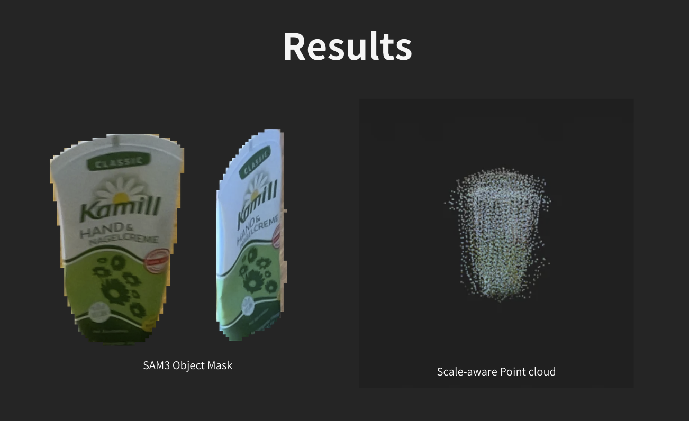

# iPhone LiDAR + ReconViaGen

This project captures RGB-D object scans on an iPhone with LiDAR, sends the scan package to a FastAPI backend, runs ReconViaGen on multi-view crops, then aligns the generated mesh back to real-world LiDAR scale.

```text
iPhone LiDAR ScanPackage.zip
  -> RGB images + depth + confidence + camera poses
  -> depth-based central object mask
  -> metric LiDAR reference point cloud
  -> ReconViaGen multi-view RGBA crops
  -> ReconViaGen raw mesh
  -> LiDAR scale + PCA/ICP alignment
  -> metric PLY / GLB / STL outputs
```




## Repository Layout

- `ios/VGGTLiDARScanApp`: SwiftUI iPhone app for LiDAR capture, scan package export, backend upload, result preview, and sharing.
- `server/api`: FastAPI orchestrator for scan parsing, LiDAR point-cloud generation, ReconViaGen routing, metric alignment, and asset export.
- `server/workers/reconviagen`: ReconViaGen worker that runs in a separate uv environment.
- `server/run.sh`: Main server entrypoint. It prepares the API environment, prepares/starts the ReconViaGen worker, then starts the API.
- `docs`: README screenshots and result images.

## iOS App

Open the Xcode project:

```bash
open ios/VGGTLiDARScanApp.xcodeproj
```

The app has a single scan-to-result flow:

1. Capture LiDAR frames with `Scan` or `Capture`.
2. Export a `ScanPackage.zip`.
3. Upload the package with `Process`.
4. Poll the backend job until reconstruction is complete.
5. Download `reconviagen_metric.ply`.
6. Preview and export the result from the result screen.

The backend URL can be changed from the gear button in the app. When testing on a physical iPhone, use an address the device can reach. `http://127.0.0.1:8000` only works from the same machine or simulator context.

## RunPod Entrypoint

This is the current one-command RunPod-style entrypoint:

```bash
bash -lc 'cd /workspace && if [ ! -d iphone-lidar-vggt/.git ]; then git clone https://github.com/mokyabun/iphone-lidar-vggt.git; fi && cd iphone-lidar-vggt && git fetch origin && git reset --hard origin/main && cd server && ./run.sh'
```

If gated Hugging Face weights are required, provide a token:

```bash
export HF_TOKEN=...
```

`run.sh` maps `HF_TOKEN` to `HUGGINGFACE_HUB_TOKEN` when the latter is not already set.

## Useful Environment Variables

Server/runtime:

```bash
export APP_HOST=0.0.0.0
export APP_PORT=8000
export APP_CACHE_ROOT=/workspace/cache
export APP_LOCAL_ROOT=/opt/iphone-lidar-vggt
export APP_RUN_ROOT=runs/api
export APP_UPDATE_ENVS=1
```

ReconViaGen setup and worker control:

```bash
export APP_PREPARE_RECONVIAGEN=0
export APP_START_RECONVIAGEN=0
export RECONVIAGEN_USE_SYSTEM_TORCH=1
export RECONVIAGEN_REFRESH=1
export RECONVIAGEN_TIMEOUT_SECONDS=2400
export RECONVIAGEN_CUMESH_URL=https://huggingface.co/spaces/microsoft/TRELLIS.2/resolve/90d6619f8152991009e68a6bdf6217a8cb7d8bb3/wheels/cumesh-0.0.1-cp310-cp310-linux_x86_64.whl
export RECONVIAGEN_FLEX_GEMM_URL=https://huggingface.co/spaces/microsoft/TRELLIS.2/resolve/90d6619f8152991009e68a6bdf6217a8cb7d8bb3/wheels/flex_gemm-0.0.1-cp310-cp310-linux_x86_64.whl
export RECONVIAGEN_O_VOXEL_URL=https://huggingface.co/spaces/microsoft/TRELLIS.2/resolve/90d6619f8152991009e68a6bdf6217a8cb7d8bb3/wheels/o_voxel-0.0.1-cp310-cp310-linux_x86_64.whl
```

Set `RECONVIAGEN_USE_SYSTEM_TORCH=1` only on images that already provide a compatible PyTorch 2.4.x install. The worker uv env will be created with system site-packages and skip installing `torch`, `torchvision`, and `torchaudio`.

Scan processing and alignment:

```bash
export SCAN_MAX_FRAMES=24
export SCAN_STRIDE=4
export SCAN_CONFIDENCE_MINIMUM=1
export RECONVIAGEN_MAX_IMAGES=6
export RECONVIAGEN_INPUT_SIZE=512
export RECONVIAGEN_CROP_PADDING=0.18
export OBJECT_DEPTH_BAND_METERS=0.45
export OBJECT_CENTER_FRACTION=0.35
export OBJECT_POINT_VOXEL_METERS=0.006
export ALIGNMENT_SAMPLES=6000
export ALIGNMENT_ICP_ITERATIONS=8
export EXPORT_PRINT_STL=1
```

External generator overrides:

```bash
export RECONVIAGEN_COMMAND='python /path/to/reconviagen_runner.py --input-dir {input_dir} --output-path {output_path}'
export RECONVIAGEN_WORKER_URL='http://127.0.0.1:8011'
```

`RECONVIAGEN_COMMAND` must read ReconViaGen input images from `{input_dir}` and write a `trimesh`-readable mesh to `{output_path}`.

## API

Main endpoints:

```text
GET  /                           static browser upload tester
GET  /health
GET  /capabilities
POST /jobs                      multipart field: scan_package
GET  /jobs/{job_id}
GET  /jobs/{job_id}/result      reconviagen_metric.ply
GET  /jobs/{job_id}/preview     reconviagen_metric.glb
GET  /jobs/{job_id}/print       reconviagen_metric_print_mm.stl
GET  /jobs/{job_id}/lidar       lidar_reference.ply
POST /reconstruct               synchronous development endpoint
```

The iOS app uses the asynchronous job flow. `POST /jobs` returns a queued job, `GET /jobs/{job_id}` reports `queued`, `processing`, `complete`, or `failed`, and `/result` returns the final metric PLY when complete.

The backend also serves a small static tester at `http://127.0.0.1:8000/`. Use it to upload local scan packages such as `test/ScanPackage-*.zip` directly from a browser, watch job polling, and download the generated PLY/GLB/STL outputs.

## Smoke Test Mode

Use mock mode to test upload, job polling, scan parsing, alignment, and result download without running the real ReconViaGen model:

```bash
cd server
RECONVIAGEN_MOCK=1 ./run.sh
```

Mock mode writes a synthetic mesh while preserving the API and export flow.

## Current Scope

This repository is now focused on the ReconViaGen + LiDAR scale-alignment path. The active project no longer includes the older standalone VGGT point-cloud pipeline, Open3D TSDF reconstruction path, SAM/Ultralytics/TIMM segmentation path, or the previous iOS pipeline selector/toggle UI.
