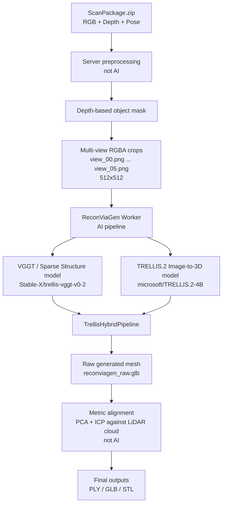
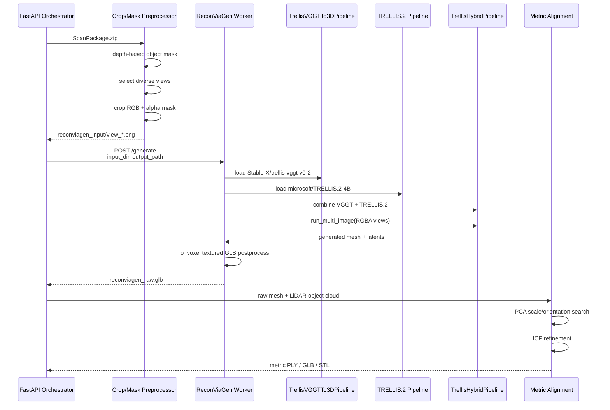

**단계별 자세한 흐름**

1. **서버가 AI 입력 이미지를 만든다**
   - Depth map에서 중앙 물체로 보이는 영역을 찾습니다.
   - 이건 AI segmentation이 아닙니다.
   - 중앙 영역 median depth 기준으로 비슷한 깊이의 connected component를 object mask로 씁니다.
   - RGB 이미지를 이 mask 기준으로 square crop합니다.
   - alpha channel에 mask를 넣어서 RGBA PNG를 만듭니다.
   - 기본 설정:
     - `RECONVIAGEN_MAX_IMAGES=6`
     - `RECONVIAGEN_INPUT_SIZE=512`
     - `RECONVIAGEN_CROP_PADDING=0.18`

2. **ReconViaGen worker가 multi-view RGBA를 로드한다**
   - `view_*.png` 파일들을 정렬해서 읽습니다.
   - 전부 `RGBA`로 변환합니다.
   - 여기서부터 AI worker 내부입니다.

3. **Sparse structure / VGGT 계열 모델 로드**
   - 모델: `Stable-X/trellis-vggt-v0-2`
   - 코드상 클래스:
     - `TrellisVGGTTo3DPipeline`
   - 이쪽이 multi-view 이미지에서 3D sparse structure 쪽 정보를 만드는 역할입니다.
   - 내부적으로 `VGGT_model`, `birefnet_model` 등을 CUDA에 올립니다.

4. **TRELLIS.2 image-to-3D 모델 로드**
   - 모델: `microsoft/TRELLIS.2-4B`
   - 코드상 클래스:
     - `Trellis2ImageTo3DPipeline`
   - shape / texture latent를 만들어 mesh로 이어지는 생성 파트입니다.

5. **Hybrid pipeline 구성**
   - 두 pipeline을 합쳐서:
     - `TrellisHybridPipeline(vggt_pipeline, trellis2_pipeline)`
   - 실제 생성 호출은:
     - `run_multi_image(...)`

6. **AI mesh generation**
   - 입력:
     - multi-view RGBA images
   - 주요 설정:
     - `pipeline_type="512"`
     - `ss_source="direct"`
     - `preprocess_image=False`
     - `max_num_tokens=49152`
     - seed 기본 `0`
   - sampler 기본값:
     - sparse structure steps: `8`
     - slat steps: `8`
     - shape steps: `8`
     - texture steps: `8`
   - 출력:
     - `meshes`
     - `latents`

7. **Textured GLB postprocess**
   - 가능하면 `o_voxel.postprocess.to_glb(...)`로 textured GLB를 만듭니다.
   - 실패하면 raw geometry mesh로 fallback export합니다.
   - 결과:
     - `reconviagen_raw.glb`

8. **AI 이후 metric alignment**
   - 이 단계는 AI가 아닙니다.
   - ReconViaGen이 만든 mesh는 실제 meter scale이 보장되지 않으므로, LiDAR object point cloud에 맞춥니다.
   - 방식:
     - mesh surface sampling
     - PCA frame matching
     - axis permutation/sign search
     - robust extent 기반 scale 추정
     - ICP refinement
   - 최종 출력:
     - `reconviagen_metric.ply`
     - `reconviagen_metric.glb`
     - `reconviagen_metric_print_mm.stl`



**중요한 결론**
현재 “AI 파이프라인”은 정확히 말하면:

```text
Multi-view RGBA crops
-> ReconViaGen worker
-> TrellisVGGTTo3DPipeline
-> Trellis2ImageTo3DPipeline
-> TrellisHybridPipeline.run_multi_image
-> raw GLB mesh
-> LiDAR metric alignment
-> final metric assets
```
